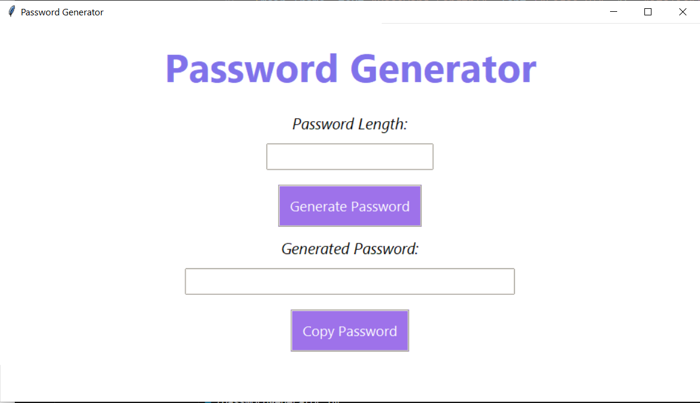
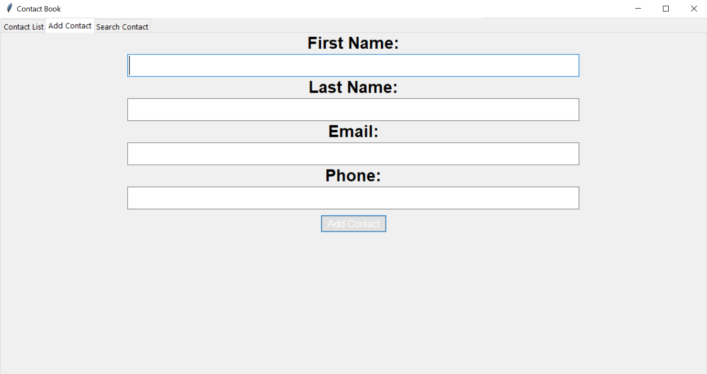
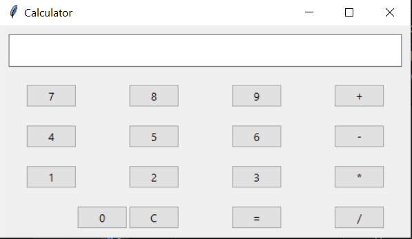

# codsoft
Python Projects
This repository contains pyhton projects I have done for the CodSoft Internship.

PROJECT 1: PASSWORD GENERATOR
This project is a password generator that generates a password of 8 characters long. It cannot generate passwords with less than 8 characters. The password can then be copied and used. Here is a picture of how it looks like:

PROJECT 2: CONTACT BOOK
This project is a contact book that stores the name, phone number and email address of a contact.
The user is able to add the details and search them. The contacts are also dispalyed in a list.
Here is a picture of how it looks like:

PROJECT 3: CALCULATOR
This project is a calculator that performs basic arithmetic operations. It can add, subtract, multiply and divide.
Here is a picture of how it looks like:

